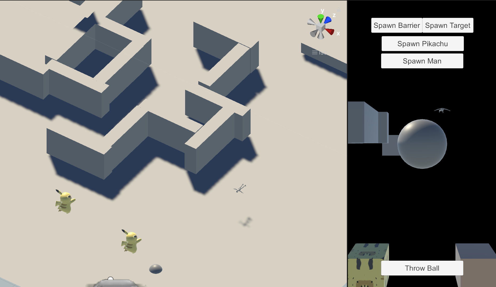

# Pikachu & Climber Tutorial:

## Function:

1.Either Pikachu or Climber can search for target spawned by master.

2.Navigation based on AR mesh landscape. (only pikachu can do this)

3.Climber climbs straightforward towards target

4.spawn virtual barrier to affect navigation.

## Manual:

for AR application:

1.disable all the Walls and Landscape

2.move agent close to camera

3.Spawn Man -> Throw ball / Spawn pikachu ->Throw ball.

## Note:

1.AR mesh is actively built at runtime at a 5s interval.(poor in performance. Could be optimized using unity event system by changing "DynamicNav.script" in this proj but haven't succeeded yet)

2.For pikachu, in code there are two kinds of navigation.(one is use nav, another is climb directly towards target). Switching between the two using agent.enable, which may cause some edge bug cases.

3.pikachu uses box collider as sensor while Climber use rayCast as sensor.

4.pikachu is based on active ragdoll while climber is not.

