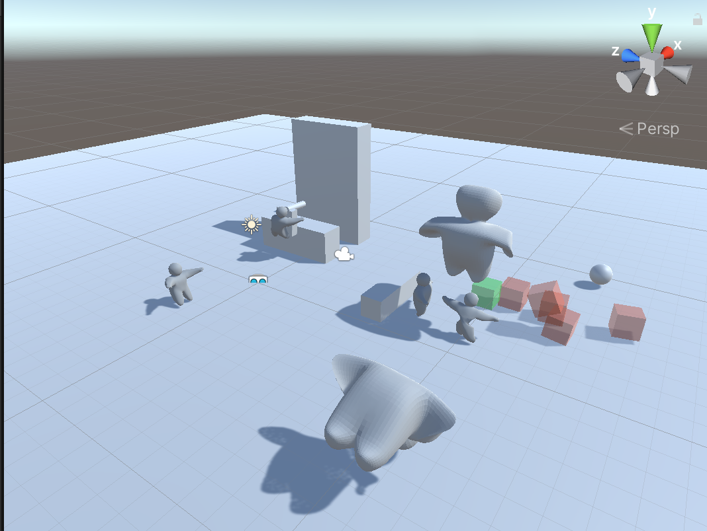

# Softbody interaction

 ## One proj with ragdoll & jelly
 
 Assets->Scenes->ActiveRagdoll
 
 Assets->jellys->jelly
 
 ## Functionality:
 
 1.auto-jumped softbody jellies.
 
 2.active ragdoll tech applied to any skeleton
 
 3.agent randomly decides to walk & stop, but forced to jump when barriers in range.
 
 ## Note:

Full explanation of how to create an active ragdoll in this video: https://www.youtube.com/watch?v=-pX-PobRLzk&t=2s

