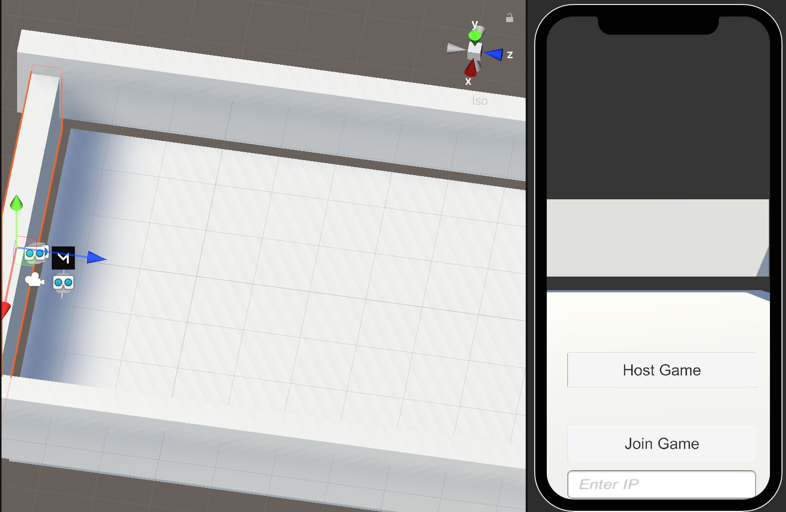

# Tutorial:
Assets->BallRollingGame->Scenes->RollingBall

 ## Function: two person AR ball rolling game

Be care to remove walls and virtual landscape while doing AR on iphone.

Using Mirror network

 ## Note: 
Two equvalent ways of position Sync through network

1. NetworkTransform (Bug free);
2. SyncCmd.script (still with some bug);

